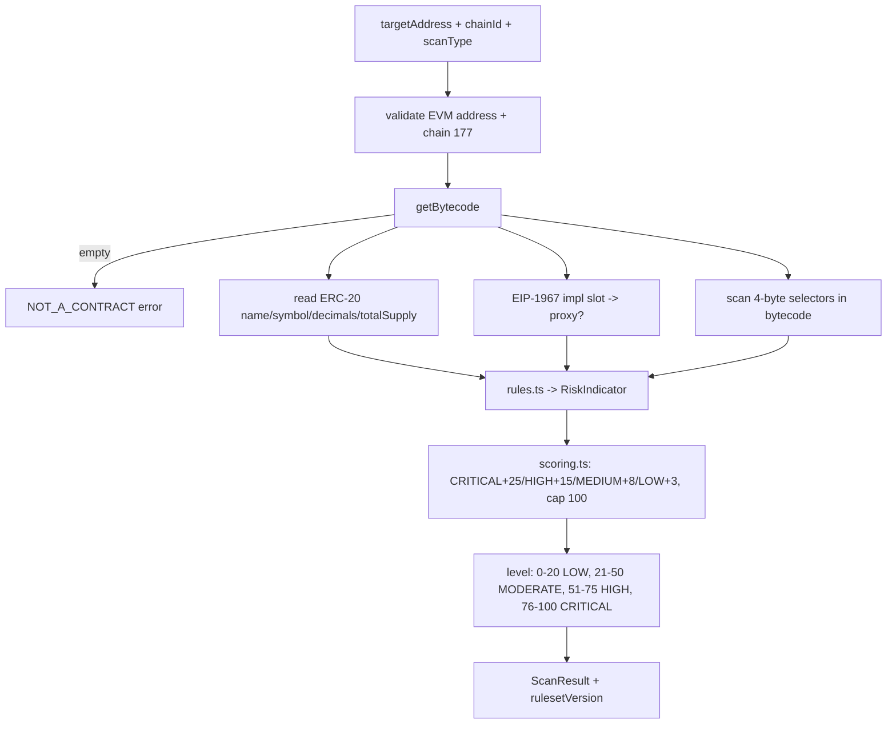
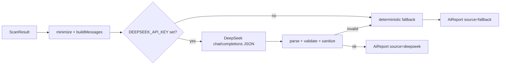
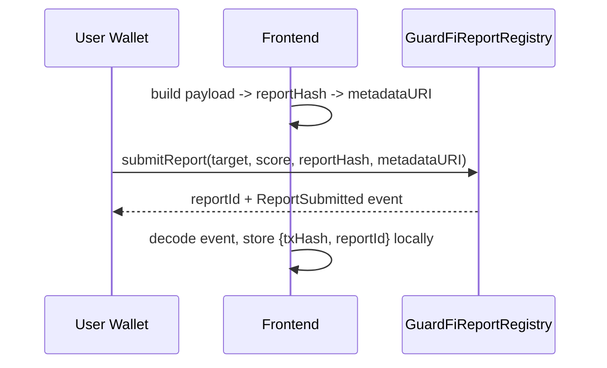
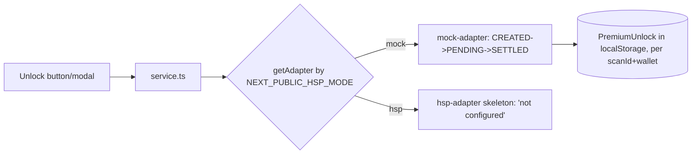

# GuardFi AI — Architecture

GuardFi AI is a monorepo with two workspaces:

- **`apps/web`** — Next.js 16 (App Router) frontend + serverless API routes. Contains the risk engine, AI report generator, report hashing, HSP adapter, and dashboard aggregation.
- **`apps/contracts`** — Hardhat workspace with the `GuardFiReportRegistry` smart contract.

There is **no traditional backend/database** in the MVP. Server-only work (RPC reads, DeepSeek calls) runs in Next.js API routes; user state lives in the browser.

---

## System overview

```mermaid
flowchart LR
  U[User + Wallet] -->|connect| FE[Next.js Frontend]
  FE -->|POST /api/scans| SCAN[Scan Engine (viem)]
  SCAN -->|reads| RPC[(HashKey Chain RPC)]
  FE -->|POST /api/reports/generate| AI[AI Report Generator]
  AI -->|optional| DS[(DeepSeek API)]
  AI -->|fallback| FB[Deterministic Fallback]
  FE -->|hash + submitReport| REG[(GuardFiReportRegistry)]
  V[Anyone] -->|getReport id| REG
  FE -->|read local| ST[(localStorage / sessionStorage)]
```

## Frontend architecture

- **App Router routes:** `/` (landing), `/connect`, `/dashboard`, `/scan`, `/scan/[id]`, `/reports/[id]`, `/verify`, `/target/[address]`, `/docs/*`.
- **Chrome:** `SiteChrome` picks `LandingNavbar` (marketing/docs/connect) or `AppNavbar` (wallet-aware app routes). `RouteGate` protects `/scan`, `/dashboard`, `/reports`, `/target` (must be connected + on chain 177). `/verify` and `/docs` are public.
- **Wallet:** wagmi + viem + RainbowKit via `Providers` (`WagmiProvider` → `QueryClientProvider` → `RainbowKitProvider`, `ssr: true`). `lib/wallet.ts` is a thin adapter over wagmi.
- **API routes (server):** `POST /api/scans` (scan engine), `POST /api/reports/generate` (AI report). These keep secrets/RPC off the client.

## Smart contract architecture

`GuardFiReportRegistry.sol` (Solidity 0.8.24) — no owner, no token, not upgradeable:

```solidity
function submitReport(address target, uint8 score, bytes32 reportHash, string metadataURI) returns (uint256 reportId);
function getReport(uint256 reportId) view returns (Report);
function getReportsByTarget(address) view returns (uint256[]);
function getReportsByReporter(address) view returns (uint256[]);
event ReportSubmitted(uint256 indexed reportId, address indexed reporter, address indexed target, uint8 score, bytes32 reportHash, string metadataURI, uint256 timestamp);
```

Validation: `target != 0`, `score <= 100`, `reportHash != 0`; `getReport` reverts `ReportNotFound` for unknown ids. `msg.sender` is recorded as the reporter — the **user's wallet signs**, never a backend.

## Risk engine flow (`lib/risk-engine`)



Everything is deterministic and reproducible; the ruleset is versioned (`rulesetVersion`). Selector detection is a best-effort heuristic.

## AI report flow (`lib/ai-report`)



The model receives **only** the structured scan result, is instructed not to fabricate data or give financial advice, and must return strict JSON. The parser fills missing fields, caps arrays, coerces invalid severities, and **strips forbidden claims** ("guaranteed safe", "certified/formal audit", "financial advice"). Any failure falls back deterministically.

## Report hashing flow (`lib/reports`)

1. `buildReportPayload(scanResult)` — stable subset (indicators sorted by code, **no volatile timestamps**).
2. `stableStringify(payload)` — recursively key-sorted JSON.
3. `computeReportHash` = `keccak256(toBytes(stableStringify(payload)))` → 32-byte `bytes32`.

The same scan always produces the same hash. AI text is **not** in the hash (kept stable and off-chain).

## On-chain registry flow



## Public verification flow

`/verify` uses a **read-only viem public client** (no wallet needed). Enter a Report ID → `getReport(reportId)` → display reporter, target, score, report hash, metadata URI, timestamp. Optionally compare a known/local report hash to the on-chain hash.

## HSP adapter flow (`lib/hsp`)



The `HspAdapter` interface (`createPaymentIntent`, `startPayment`, `getPaymentStatus`, `isPremiumUnlocked`) isolates HSP so a real provider can replace the mock without touching the UI. Real-provider secrets must go through a future server route, never the client.

## Storage strategy (MVP)

| Data | Store | Key |
|---|---|---|
| Scan result | sessionStorage | `guardfi:scan:<scanId>` |
| AI report | localStorage | `guardfi:aireport:<scanId>` |
| On-chain submission | localStorage | `guardfi:submission:<scanId>` |
| Premium unlock | localStorage | `guardfi:premium:<scanId>:<wallet>` |

The dashboard reads these safely (skips corrupt entries) and filters premium unlocks by connected wallet.

## Limitations (honest)

- Local storage is a **dev/MVP convenience**; it can be edited and is per-browser. Production must verify access/payment server-side and persist properly.
- Selector detection is best-effort; it does not see logic behind proxies and can have false positives/negatives.
- Source verification is `unknown` (no explorer lookup yet). Liquidity/holders are out of scope.
- The real HSP adapter is a skeleton. Scan results live in sessionStorage (cleared on tab close).
- The public RPC can rate-limit write/estimate calls; a managed RPC is recommended for demos.

## Production roadmap (summary)

Server-side persistence + payment verification, real HSP adapter, IPFS for `metadataURI`, Blockscout source-verification lookup, contract verification automation, more risk rules, monitoring/alerts. See [`ROADMAP.md`](ROADMAP.md).
